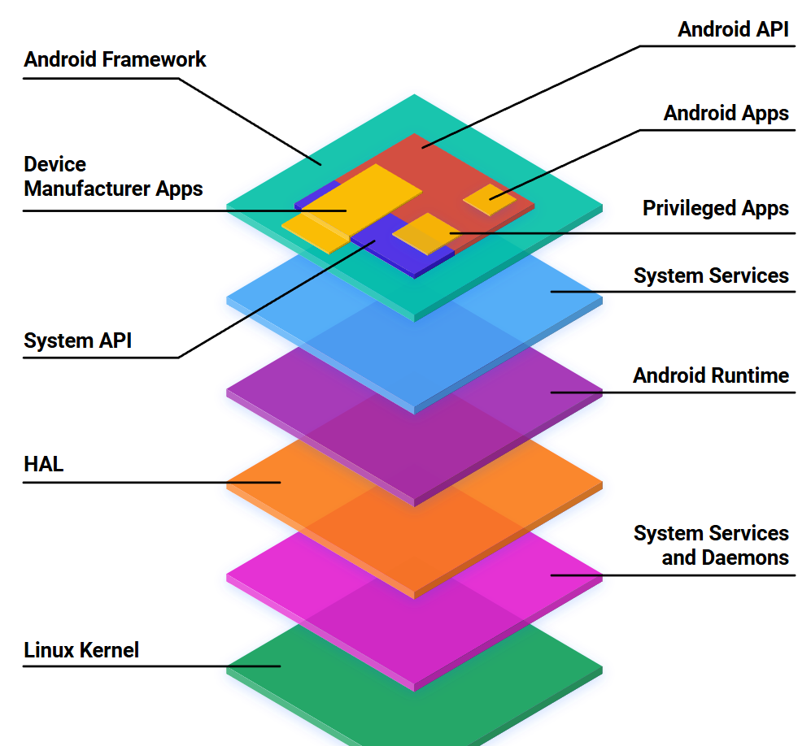

# Kiến trúc Android chung
## Lớp ứng dụng
- Vùng chứa: `ứng dụng hệ thống`, `ứng dụng thông thường`

## Lớp Android Framework
- Cung cấp API dành cho nhà phát triển ứng dụng, ứng dụng android cần lớp này để hoạt động
- Component:

  + `Activity Manager`: Hoạt động
  + `Location Manager`: Vị trí
  + `Package Manager`: Ứng dụng cài đặt
  + `Notification Manager`: Thông báo, thanh trạng thái
  + `Resource Manager`: quản lý hình ảnh, file, layout, ...
  + `Telephony Manager`: Quản lý thoại, hệ thống SIM mạng
  + `Window Manager`: Quản lý cửa sổ mở, tác vụ
  + `Content Provider`: Chia sẻ dữ liệu giữa ứng dụng khác
  + `View System`: Quản lý hệ thống view ứng dụng, layout

## Lớp Runtime (SRL)
- Gồm lib C++ và ART (Android runtime/Dalvik)
  + Thư viện C++ sử dụng để xử lý 1 số hệ thống nhẹ
    + SQLite, SSl
    + OpenGL
    + Font chữ cơ bản
  + Android Runtime
    + Dalvik VM (Tương tự JVM nhưng tốt hơn):
       + Có lớp Instance nằm trong VM dùng để quản lý bộ nhớ, bảo mật và tối ưu hóa
       + Mỗi ứng dụng được Dalvik thực thi riêng biệt
    + ART VM (Chuyên dùng từ android 5.0 trở lên thay thế Dalvik):
       + Hiệu suất cao nhờ biên dịch trước (AOT - Ahead-of-Time)
       + Tối ưu hệ thống
       + Hoạt động được với ứng dụng sử dụng Dalvik
       + Hỗ trợ nhiều kiến trúc khác nhau
       + Bảo mật và cách ly ứng dụng, tạo ra hệ thống quyền ngăn cách

## Lớp trừu tượng HAL (Hardware Abstraction Layer)
- Nằm giữa hệ thống và phần cứng, hỗ trợ tương tác với các phần cứng, tăng khả năng tương thích cho từng phần cứng độc lập, riêng biệt, giảm bớt phức tạp trong quá trình bảo trì

## Lớp nhân Kernel
- Được phát triển bởi Linux, dựa trên kiến trúc lớp nhân Linux dùng để quản lý các phần cứng như tai nghe, phím cứng, usb, quản lý bộ nhớ, giao thức mạng
- Tách biệt Kernel -> Hệ thống Bootloader, sử dụng để tải đĩa hệ thống
- Hệ thống Recovery
