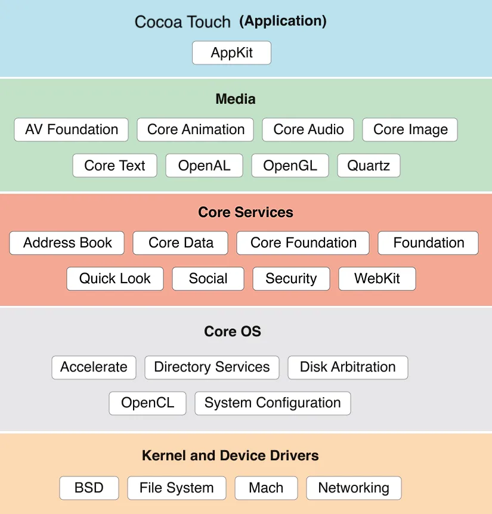

# Cấu trúc cơ bản IOS App
## Framework Cocoa Touch
- Sử dụng cho phát triển ứng dụng, khung chính ứng dụng IOS

## Media
- **AV Foundation**: Làm việc âm thanh, video, xử lý ghi âm, ...
- **Core Animation**: Làm việc với các hiệu ứng, tạo hiệu ứng phức tạp
- **Core Audio/Image/Text**: Xử lý âm thanh, phân tích hình ảnh và cung cấp văn bản
- **OpenAL/OpenGL**: API phát âm thanh 3D và trình độ họa 2D/3D
- **Quartz**: Bộ công cụ xử lý hình ảnh 2D

## Core Service
- **Address Book**: Quản lý danh bạ
- **Core Foundation/Foundation**: Quản lý lưu trữ, dữ liệu
- **Quick Look**: Xem trước thông tin tệp
- **Social**: Cung cấp mạng xã hội tích hợp
- **Security**: Cung cấp keychain, mã hóa, chứng thực, ...
- **Webkit**: Engine trình duyệt web của Apple, sử dụng cho Webview

## CoreOS
- **Accelerate**: Cung cấp trong việc tối ưu hóa hiệu suất, tính toán
- **Directory Services**: Quản lý thư mục
- **Disk Arbitration**: Quản lý và gắn kết các thiết bị lưu trữ
- **OpenCL**: Sử dụng để hỗ trợ ứng dụng lập trình viên có thể chạy trên nhiều bộ tính toán khác nhau như GPU, CPU, ....
- **System Configuration**: Cấu hình hệ thống, quản lý mạng

## Kernel and Device Drivers
- **BSD**: Sự kết hợp với Mach để tạo nên XNU, quản lý dịch vụ bộ nhớ, tiến trình, lõi hệ thống, mạng, ...
- **File System**: Quản lý hệ thống tệp và truy cập dữ liệu
- **Networking**: Quản lý các giao thức và dịch vụ mạng

